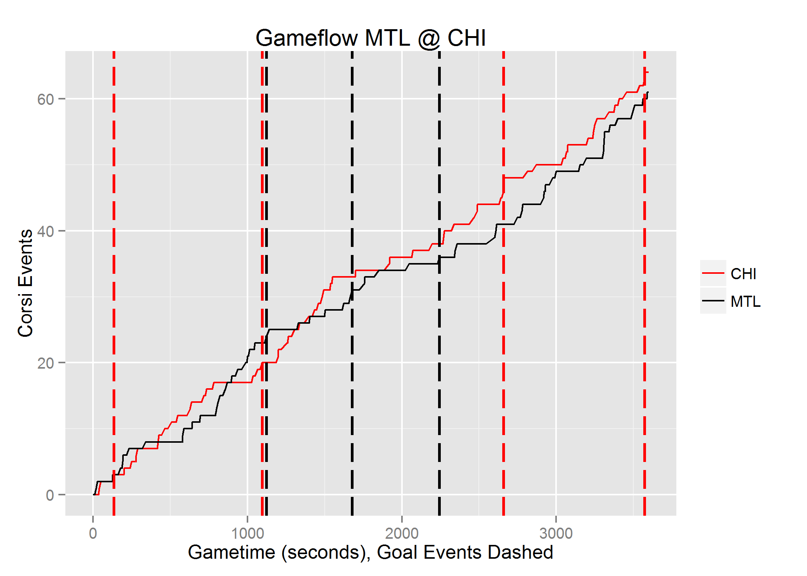

##Introduction and Purpose  

For the final project I will examine NHL play by play data using a relatively new R package called nhlscrapr (http://cran.r-project.org/web/packages/nhlscrapr/index.html). The motivation for this work is simple: All "advanced" NHL statistics depend on this play by play data. It is the lifeblood of the hockey analytics community. Being able to acquire, clean and store this data can be seen as a de-factor barrier of entry to any real custom analysis in this domain. The nhlscapr package downloads publicly viewable nhl report files from the web (ex. http://www.nhl.com/scores/htmlreports/20142015/PL020324.HTM ) and creates concise, easily understandable dataframes in R. These dataframes can then be used for whatever game level analysis is required.

For this project, I will create a system that automatically downloads the data from the previous night's games and create "gameflow" diagrams using ggplot. An example of a gameflow diagram can be seen below. The NHL's regular season schedule will be stored in a CSV file and will be queried for the gamecodes of the previous night's slate of games.

Additionally, I will store the play by play data in a newly created relational table in PostgreSQL.  Once here, it would be possible for the events to be mapped to a playerID schema of an existing system.  This hypothetical system does not exist and our work at the relational database level will stop with the load of the raw data.

##Dataflow overview

The dataflow of the system can be seen in the diagram below


The play by play data is sourced from the web on NHL.com while the schedule data resides in the csv file "sched.csv".  Each set of data is brought into the R environment programaticaly where it is then cleaned, massaged and manipulated into the dataflow diagrams that we desire.  The dataflow diagrams are then stored to disk as .png files.

The raw play by play data is transformed into a relational database table leveraging the package "RODBC".  RODBC was chosen as a package for future flexibility. ODBC is a middleware layer that allows for connections to a variety of database back ends with minimal changes to application layer code.  In theory, if we were to swap my back end to another relational database system, MS SQL Server for instance, we would simply have to change my connection string and the ODBC layer would handle the rest.

Important note: In order for the RODBC portion of this code to work on your machine, you need to ensure that you have the correct Postgresql ODBC driver installed on your machine.  This varies by OS so i cannot include it with my submission package.  Drivers for Windows users can be found here: http://www.postgresql.org/ftp/odbc/versions/msi/

## Program Flow

The following flowchart gives a high level overview of how the program functions.


## Code

The following sql can be run in PostgreSQL to generate the required database and table to which the data will be loaded.

### SQL

```SQL
-- Database: "CUNY607"

-- DROP DATABASE "CUNY607";

CREATE DATABASE "CUNY607"
  WITH OWNER = postgres
       ENCODING = 'UTF8'
       TABLESPACE = pg_default
       LC_COLLATE = 'English_Canada.1252'
       LC_CTYPE = 'English_Canada.1252'
       CONNECTION LIMIT = -1;

-- Table: pbpraw

-- DROP TABLE pbpraw;

CREATE TABLE pbpraw
(
  season character varying(255),
  gcode character varying(255),
  refdate double precision,
  event integer,
  period double precision,
  seconds double precision,
  etype character varying(255),
  a1 character varying(255),
  a2 character varying(255),
  a3 character varying(255),
  a4 character varying(255),
  a5 character varying(255),
  a6 character varying(255),
  h1 character varying(255),
  h2 character varying(255),
  h3 character varying(255),
  h4 character varying(255),
  h5 character varying(255),
  h6 character varying(255),
  evteam character varying(255),
  evplayer1 character varying(255),
  evplayer2 character varying(255),
  evplayer3 character varying(255),
  distance double precision,
  type character varying(255),
  homezone character varying(255),
  xcoord double precision,
  ycoord double precision,
  awayteam character varying(255),
  hometeam character varying(255),
  homescore double precision,
  awayscore double precision,
  eventlength double precision,
  awayg character varying(255),
  homeg character varying(255),
  homeskaters double precision,
  awayskaters double precision,
  ishomeshevent double precision,
  isawayshevent double precision,
  homecummulative double precision,
  awaycummulative double precision
)
WITH (
  OIDS=FALSE
);

```

### R

First, some setup items.  Load the libraries we need plus set a couple of string constants.  Note that these strings will need to be set to appropriate values on your machine.

```{r}
library(nhlscrapr)
library(RODBC)
library(ggplot2)
library(reshape2)

scheduleFileLocation ="C:/CUNY/IS607/Final Project/sched.csv"
postgreSQLconnectionString = "driver={PostgreSQL ANSI(x64)};server=localhost;database=CUNY607;uid=Justin;pwd=password"
```

Now, our function that does most of our leg work.  Please see inline comments for details.

```{r}
processgame <- function(gID)
{ 
  # download gamefiles from NHL.com and process the data into r dataframes
  gamedata = process.single.game (season="20142015",
                           gcode=toString(gID),
                           rdata.folder="nhlr-data",
                           override.download=FALSE,
                           save.to.file=TRUE)
  
  # Get the play by play event log. It comes to us as dataframe
  pbpRaw<-gamedata$playbyplay
  
  # Exclude events from a shootout (if there is one)
  pbpRaw = subset(pbpRaw, period<5)
  
  # Home and away teams labels found here
  awayteam <- gamedata[3]$teams[1]
  hometeam <- gamedata[3]$teams[2]
  
  pbpRaw$isHomeShEvent = (pbpRaw$etype=="SHOT"|pbpRaw$etype=="GOAL"|pbpRaw$etype=="MISS"|pbpRaw$etype=="BLOCK") & pbpRaw$ev.team==hometeam
  pbpRaw$isHomeShEvent = pbpRaw$isHomeShEvent * 1
  
  pbpRaw$isAwayShEvent = (pbpRaw$etype=="SHOT"|pbpRaw$etype=="GOAL"|pbpRaw$etype=="MISS"|pbpRaw$etype=="BLOCK") & pbpRaw$ev.team==awayteam
  pbpRaw$isAwayShEvent = pbpRaw$isAwayShEvent * 1
  
  # create running totals of events we are concerned with for both home and away teams
  pbpRaw$homeCummulative = cumsum(pbpRaw$isHomeShEvent)
  pbpRaw$awayCummulative = cumsum(pbpRaw$isAwayShEvent)
  
  # extract goal only events.  Will be used at the end of the plotting step
  goalEventsHome = subset(pbpRaw, (etype=="GOAL")&event!=1&ev.team==hometeam, select=c(seconds))$seconds
  goalEventsAway = subset(pbpRaw, (etype=="GOAL")&event!=1&ev.team==awayteam, select=c(seconds))$seconds
  
  # subset the data to what we need only
  pbpraw_sub = pbpRaw[,c("seconds","homeCummulative","awayCummulative")]
  colnames(pbpraw_sub) <- c("seconds",hometeam, awayteam)
  
  # wide to long with reshape2, ty HW
  dd = melt(pbpraw_sub, id=c("seconds"))
  plot = ggplot(dd) + geom_line(aes(x=seconds, y=value, colour=variable)) +
    scale_colour_manual(values=c("red","black")) + scale_y_continuous(name="Corsi Events") + scale_x_continuous(name="Gametime (seconds), Goal Events Dashed")
  
  title = sprintf("Gameflow %s @ %s", awayteam, hometeam) 
  plot + theme(legend.title=element_blank()) + ggtitle(title) + geom_vline(xintercept = goalEventsHome, color="red", size = 0.8, linetype="longdash" )+ geom_vline(xintercept = goalEventsAway, color="black", size = 0.8, linetype="longdash" )
  
  #save image to our working directory
  fileName=paste(gID,".png")
  ggsave(file=fileName)
  
  # Load data into PostgreSQL for future analysis
  channel = odbcDriverConnect(postgreSQLconnectionString)

  sqlSave(channel, pbpRaw, rownames = F, addPK = F, append = T)

  #clean up connection
  odbcClose(channel)
  print(paste("Processed ", gID))
}
```

And now for the "main" of our program.  This is where we load in our schedule from CSV, grab the gameIDs from yesterday's games and call our process game function.

```{r}
#Get yesterday's date as a string
yest<-strftime(Sys.Date()-1)

#import our schedule from a csv file
sched = read.csv(scheduleFileLocation, header = TRUE)

#only process yesterday's games
yestGameIDs = subset(sched, GameDate==yest)$GameID

#process each game in our subset (yesterday's games)
for(gID in yestGameIDs){
  result <- tryCatch({
    processgame(gID)
  }, warning = function(war)
  {
    return(0)
  }, error = function(err)
  {
    return (0)
  }, finally = {
    
  })
  
}
```

## Sample Output



## Discussion and Conclusion

I set out to create a basic ETL process for NHL play by play data with the added step of creating a visual representation of a game that has become a staple in the hockey analytics community.  With the above code, I have accomplished this goal to a satisfactory degree.

I encountered two sticky points while developing this project.  The first was finding the correct ODBC driver to use on my machine for my versions of PostgreSQL and Windows.  Despite installing the 32 bit version of PostgreSQL on my machine, I needed to install the 64 bit version of the ODBS driver.  This was not immediately obvious and took a bit of trial and error (downlodingand installing a few different versions of the driver).  ODBC isn't a new technology and the inclusion of it in the project is perhaps my most suspect decision due to the driver dependencies.  It was MUCH easier to get the package 'RPostgreSQL' up and running with the obvious downside being that it ties the project to a PostgreSQL backend.

Extensions:  The first extension that comes to mind is to take the visual layer out of R and use a friendlier web technology to create some interactive charts.  There are numerous jQuery libraries out there that do a better job (in my opinion) of plotting data than ggplot2 does.  To do this, the analyis layer here would need to be abstracted to a webservice which either calls out to R to get the transformed data or does it entirely in another language.  I can see both approaches working wtihout too much of an issue. 

The second extension that seems fairly obvious is to build out the relational database schema.  I've kept things in one table for this simple application, mostly as a proof of concept.  The next logical step is to create a "master" players table with an id system.  Having each play by play event require a full name and number for every player on the ice is definitely not how you would want to persist this data in a production envrionment. 
